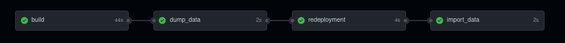

# swis-api (swapi)

[](https://github.com/savla-dev/swis-api/actions/workflows/docker-image.yml)

[sakalWeb (v5) Information System RESTful API (intranet)](http://swapi.savla.su)

## repo vademecum

### .assets

This folder contains static assets like images (favicon), that are served by server statically (not dynamically).

### .bin

This folder contains executables for swapi package management, like data importing batch script.

### .data

Crutial folder for all data to be imported to a running instance, for this purpose, .bin/ importing scriped is used. This folder is used as temporary data backup.

### .env

Capital configuration file containing environment constants for `Makefile` and other linked files like `docker-compose.yml`.

### main.go

Main package's logic is coded there, main package's entrypoint.

### modules

All swapi modules are stored in their folders. Every module has its `models.go` file with data structures, `controllers.go` with its methods and functions, and `routes.go` for gin router to serve module's handles.

### Dockerfile

Recipe for docker image build using `docker build .`

### Makefile

Dev/build recipe for GNU `make` tool. Listing (Jan 14, 2022):

```shell
$ make

 swis-api / Makefile 

 make --- show this helper 

 make fmt  --- reformat the go source (gofmt) 
 make docs --- render documentation from code (swagger OA docs) 

 make build --- build project (docker image) 
 make run   --- run project 
 make logs  --- fetch container's logs 
 make stop  --- stop and purge project (only docker containers!) 

 make import_dump --- import dumped data (locally) into runtime 
 make dump        --- dump runtime data to DUMP_DIR 
 make backup      --- execute data dump and tar/gzip data backup 

```

### docker-compose.yml

YAML-formated file for docker-compose stack. Contains defitions for docker container and its isolated network. Uses constants from `.env` dot-file.


## documentation

[swagger 2.0 is used to document API scheme](http://swapi-docs.savla.su)

```
# at project root run 
go install github.com/swaggo/swag/cmd/swag@latest
swag init .

# generate docs, build local binary (implicitly)
make docs

# run server
./swis-api

# view
http://localhost:8999/
```

## staging and deployment

As far as the deployment architecture is concerned, the codebase is designed to follow (mostly) [12factor guidelines](https://12factor.net). Thus there is a difference between a build and release and runtime stages.



## authentication

Swapi uses token-based authentication for any request to be authenticated, For initial importing, `ROOT_TOKEN` (see [`.env`](/.env) file) is used by importing executable. For any request, the header `X-Auth-Token` has to be sent with a custom HTTP request.

## service backup report example

```shell
SIZE=$(du -shx ${BACKUP_TARGET_DIR}/${TIMESTAMP}.sqlite.gz | awk '{ print $1 }')
STATUS=success

# report back to swapi/backups
SERVICE_NAME=generic-sqlite-service
TIMESTAMP=$(date +%s)
TOKEN=xxx
curl -X PUT -sL -H "X-Auth-Token: $TOKEN" \
        --data "{\"service_name\":\"$SERVICE_NAME\", \"timestamp\": $TIMESTAMP, \"last_status\": \"$STATUS\", \"backup_size\": \"$SIZE\", \"filename\": \"${TIMESTAMP}.sqlite.gz\" }" \
        http://swis-api-hostname/backups/${SERVICE_NAME}
```

## importing

At start, swapi instance memory is cleared and ready for any data import (until the next restart). Any data stored in runtime memory should be dumped using GET methods at particular paths. This approach should make `swapi` instance universal (while omitting custom packages/modules).

```shell
# run local instance (redeployment CI/CD job)
make build run

# dump production data locally
make dump

# import prod data -- local .data files to swapi.savla.su prod URL (import_data CI/CD job)
make import_prod_static_data
```
